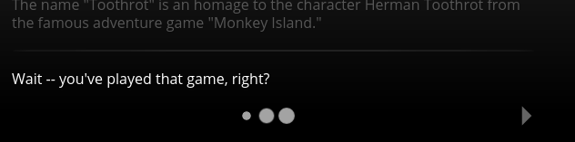

/---- previous
[Timeout](timeout.md)
----/

# Auto Next

If you want the next node of a node to be displayed automatically after some time has passed,
the `autonext` property is what you can use:

```toothrot
### some_node

(#) autonext: 5000

This is some node.

(>) some_other_node


### some_other_node

This is the other node.

(<)
```

The fact that `autonext` is defined for a node can bee seen in the game in the form of
the *autonext [indicator](indicators.md)*, three growing and shrinking dots:



Quite similar to the [timeout property](timeout.md), the `autonext` property's value is the
number of milliseconds to wait before going to the next node. The big difference between
the two is that when you use the `autonext` property, no bar is being displayed that indicates
the remaining time before switching nodes.

So if you just want to make the experience smoother for the user by automatically going to the
next node if no user action (like a click on the screen) is taken, then `autonext` is what
you should use. If, on the other hand, you want to force the user to pick an option in a
certain amount of time, use `timeout` instead.

## Auto Next Target

Normally, after the `autonext` time is over, the [next node](next-node.md) or
the [previous node](return-to-last.md) is shown. But sometimes you might want to automatically
go to a node while no next node or return is specified -- or you might want to take
the user to a different node than the next node when she doesn't interact with the game.

To accomplish this, Toothrot has the `autonextTarget` property. This property expects as its
value a string containing the ID of a node:

```toothrot
### yet_another_node

(#) autonext: 5000
(#) autonextTarget: "some_node"

You've reached the end of this story. Or have you?

### some_node

You did not reach the end. It's not true, it's bullshit. You did not reach the end.
You did **nooot**.

Oh, hi Marc!

(<)
```

In the example above, the user has no way to progress the story except for waiting 5 seconds,
after which the engine will take her to the `some_node` node.

```toothrot
### and_another_node

(#) autonext: 10000
(#) autonextTarget: "lazy"

Will you take action or are you a lazy person?

(>) action

### lazy

You little sloth! ;)

### action

Good things will come to those that bother to put in the effort.
```

In the example above, if the user doesn't do anything after coming to the `and_another_node` node
within 10 seconds, the `lazy` node will be displayed. If she clicks on the screen or presses
the next button though, the story will move to the `action` node.

/---- next
[Default Settings](default-settings.md)
----/
