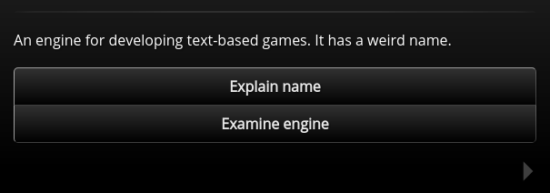
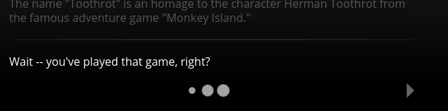
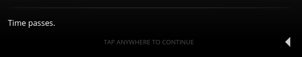

/---- previous
[Default Settings](default-settings.md)
----/

# Indicators

There are 3 types of indicators in Toothrot:

* **Next indicator:** A right-facing triangle, shown when there's a [next node](next-node.md)
* **Return indicator:** A left-facing triangle, shown when a
  [return to the last node](return-to-last.md) is defined
* **Autonext indicator:** Three growing and shrinking dots, shown when [autonext](auto-next.md)
  is enabled for the node

The *next indicator* looks like this:

The *return indicator* looks like this:

And last but not least, the *autonext indicator* looks like this (*next indicator* shown as well):

## Disabling indicators

Both the *next indicator* and the *return indicator* can be disabled via
[settings](default-settings.md) or via [node propeties](node-properties.md).

The indicators are displayed according to the following rules:

* If the *next indicator* is disabled, the *autonext indicator* is displayed instead
* If the *return indicator* is disabled, the *next indicator* is displayed instead
* If the the *return indicator* is disabled and the *next indicator* is disabled as well,
  the *autonext indicator* is displayed instead
* The node properties take precedence over the settings

The setting or node property to enable or disable the *return indicator* is `useReturnIndicator`.

The setting or node property to enable or disable the *next indicator* is `useNextIndicator`.

## Hint text

If an indicator is displayed and the player doesn't act within 5 seconds, a little hint text
is displayed to inform the player that she can click anywhere on the screen to continue
the story:

To adjust the time that has to pass before the hint text is displayed, the `indicatorHint`
[setting](default-settings.md) can be set. It expects the time in milliseconds. If
the `indicatorHint` setting is set to `0`, then *no* hint will be displayed.

/---- next
[Back to documentation index](../index.md)
----/
