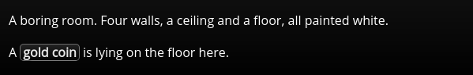
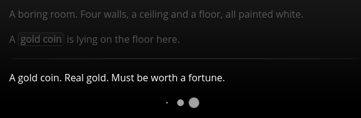

/---- previous
[Scripts and Slots](scripts-and-slots.md)
----/

# Special Scripts

Normally, scripts are only executed if they are referenced in a node's text. But there are
some special scripts that are executed even if they are not referenced in the text.

Currently, the engine recognizes these special script names:

| Script name (`@[name]`) | Context    | Executed when?                      |
|:------------------------|:-----------|:------------------------------------|
| @entry                  | Node       | When entering the node              |
| @brief                  | Node       | When parent node is displayed       |
| @entry                  | Section    | When entering the section           |
| @node_entry             | Section    | When entering a node in the section |
| @node_entry             | Global     | When entering a node                |
| @section_entry          | Global     | When entering a section             |

You can use `@entry` to ensure a script is executed each time before the node where it
is written in gets displayed.

## The @brief script

An `@brief` script is a little more complicated to understand. Nodes can contain other nodes.
To enable the player to actually interact with the child nodes of a node, some text must be
displayed informing the player about the existence of the child node.

To accomplish this, the `@brief` script of the child is called before displaying the parent node.
The return value of the `@brief` script is then displayed right under the parent's node text.

For example, let's say you want to have a room where a gold coin is lying on the floor. You
would then write two nodes: one for the room, another for the coin:

````toothrot
### the_room

(#) contains: ["gold_coin"]

A boring room. Four walls, a ceiling and a floor, all painted white.


### gold_coin

```js @brief
"A {gold coin} is lying on the floor here."
```

A gold coin. Real gold. Must be worth a fortune.

(<)
````

The `the_room` node will be displayed in the game like this:



And if you then click on `gold coin`, you will see:




/---- next
[Variables](variables.md)
----/
