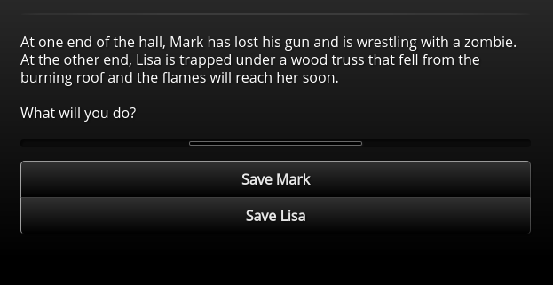

/---- previous
[Option Menus](option-menus.md)
----/

# Option Timeout

Sometimes you want the player to choose an option in a certain amount of time to increase
the engagement or make the game a little more challenging. Toothrot allows you to do this
with the `timeout` node property:

```toothrot
## zombie_challenge

(#) timeout: 20000

At one end of the hall, Mark has lost his gun and is wrestling with a zombie. At the other end,
Lisa is trapped under a wood truss that fell from the burning roof and the flames
will reach her soon.

What will you do?

(@) Save Mark => save_mark
(@) Save Lisa => save_lisa
```

This node will look like this in the game:



The little bar above the options gets shorter and shorter. When it's gone, the timeout has been
reached.

The `timeout` property expects the time in milliseconds (1/1000 of a second). So in the example
above, the player has 20 seconds to choose one of the options.

If the player doesn't choose something in time, the first option will be chosen automatically.
If that's not what you want, you can use the `defaultOption` property to tell the engine
which option should be used when the player can't decide:

```toothrot
(#) defaultOption: 1
```

/---- info
The `defaultOption` property is a zero-based number, that means that `0` is the first option
and `1` is the second.
----/
