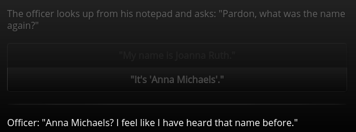

/---- previous
[Special Scripts](special-scripts.md)
----/

# Variables

Variables allow you to insert a piece of text into your story multiple times in such a way
that if you change the *value* of the variable, all of the spots where you used the variable
in your text change as well automatically.

You can think of a variable as a box that has a label (the *variable name*) and contains stuff
(the *variable value*).

## Defining variables

Variables can be defined inside scripts like this:

````toothrot
```js @my_script
$.fruit = "banana";
```
````

This script defines a variable called `fruit` and gives it the value `"banana"`. The `$` is
a container that holds all of the variables of the story. These variables are saved in savegames
when a user saves the game.

## Using variables in node text

The current value of a variable can be inserted into the text of a node like this:

````toothrot
### my_node

```js @entry
$.fruit = "banana";
```

The fruit of the day is the `$fruit`.

A `$fruit` is a very tasty and healthy thing to eat.
````

This node will be displayed in the story as follows:

    The fruit of the day is the banana.
    
    A banana is a very tasty and healthy thing to eat.

You might wonder: "What's the point of this? I can just write 'banana' directly and be
done with it."

The point of using a variable here is that if you change `$.fruit = "banana";` to
`$.fruit = "peach";` all of the places where you used `` `$fruit` `` will change at once.
The resulting text would then be:

    The fruit of the day is the peach.
    
    A peach is a very tasty and healthy thing to eat.

Variables can be very useful for things like character names. For example, if you decide to
rename your protagonist later on during the writing process of your story, you could just
change the value of `$protagonist` to a new one instead of replacing the protagonist's
name in *all* of your story files.

## Changing the value of a variable during play

The value of a variable can be changed in response to some action of the player. For example,
let's say we want to allow the player to choose the protagonist's name from a list of names.
This can be done using variables and option menus like this:

````toothrot
### choose_name

The officer looks up from his notepad and asks: "Pardon, what was the name again?"

(@) "My name is Joanna Ruth." => set_name | Joanna Ruth
(@) "It's 'Anna Michaels'." => set_name | Anna Michaels

### set_name

```js @entry
$.name = $._choice;
```

Officer: "`$name`? I feel like I have heard that name before."
````

The result will look like this:


