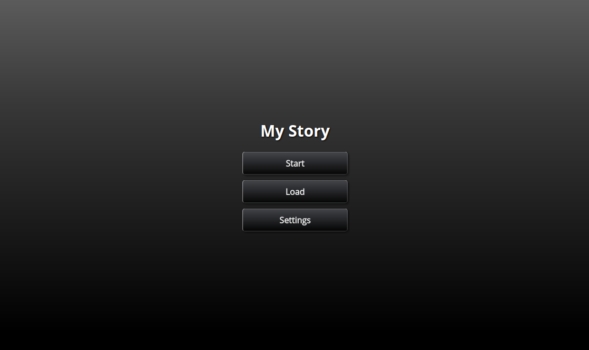

# Toothrot Engine

    

        <button class="ide-download-button cta-button">
            <svg xmlns="http://www.w3.org/2000/svg" width="20" height="20" class="fill-black icon">
                <use xmlns:xlink="http://www.w3.org/1999/xlink" xlink:href="#icon-download"></use>
            </svg>
            Download Toothrot IDE 2.0.0
        </button>
        

            

                <a href="https://github.com/toothrot-if/toothrot/blob/develop/CHANGELOG.md">
                CHANGELOG
                </a>
            

            Supported Systems:
            <a class="downloadLink" data-os="windows" target="_blank" href="#win">Windows</a>,
            <a class="downloadLink" data-os="mac" target="_blank" href="#mac">Mac OS</a>,
            <a class="downloadLink" data-os="linux" target="_blank" href="#linux">Linux</a>
        

    

[IDE Quick Start Guide](docs/user/after-ide-download-windows.md)

[IDE Quick Start Guide](docs/user/after-ide-download-mac.md)

[IDE Quick Start Guide](docs/user/after-ide-download-linux.md)

## What is it?

Toothrot is an engine for text-based games (interactive fiction). It helps you write
interactive stories that run in both desktop and mobile browsers or even as regular desktop
applications (Win, Mac, Linux).

Check out [an example game](https://games.toothrot.one/cloak-of-darkness/) (
[source](https://raw.githubusercontent.com/toothrot-if/toothrot-examples/master/cloak-of-darkness/resources/story.trot.md)) or watch the short video
below:

<video src="{rootDir}docs/videos/gameplay.webm" controls poster="{rootDir}docs/videos/gameplay.png">
Sorry, your browser doesn't support embedded videos.
</video>

[Download video](file: docs/videos/gameplay.webm)

Toothrot incorporates elements from many different flavors of text-driven games:

* It has a **text stream** like known from the *Lifeline* games
* Text can have **hyperlinks** like in *Twine*
* you can go from one text to **the next by clicking** anywhere on the screen or
  pressing a button like in *visual novels*
* You can have **choice buttons** below a piece of text like in *Inkle* or *ChoiceScript*
games
* You can develop your own **world model** similar to those in *text adventures*

Games are written in an **eye-friendly format** similar to *markdown*. You can use *JavaScript* to
make the games even more interactive, though knowing JavaScript is not required for
writing basic stories.

Toothrot is fully **open source** and allows developing commercial games, too.

## Why should you use Toothrot?

&#x2713; You should consider writing your game using Toothrot when...

* ...you want to use both **hyperlinks** and **choice buttons** in the same game
* ...you want an easy way to go to the **next** piece of text (like in visual novels)
* ...you want to have a ready-to-use **savegame** mechanic (using browser storage or images)
* ...you've grown out of Twine and want to write something a little more complex
* ...you want to write your game with more than one person
* ...you want **keyboard navigation** in your games
* ...you need a fully **customizable screen system** (think pause or stats screen)
* ...you want to have choices with a **timer** (similar to Telltale games)
* ...you want to use background **images**, **sounds**, music or ambience
* ...you want text to appear character by character
* ...you want to develop a more involved **world model** than just using variables

&#x274c; You probably shouldn't use Toothrot when...

* ...you need an editor that hides all the technical details from you
* ...you want to display massive amounts of text at once (try ChoiceScript instead)

/---- info
Want to give the engine a try? Read the
[Quick Start Guide](docs/user/guides/quick-start-ide/index.md)!
----/
